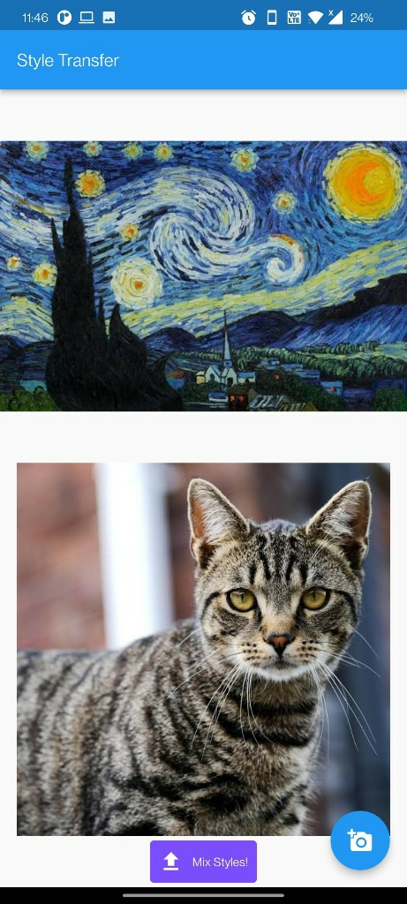
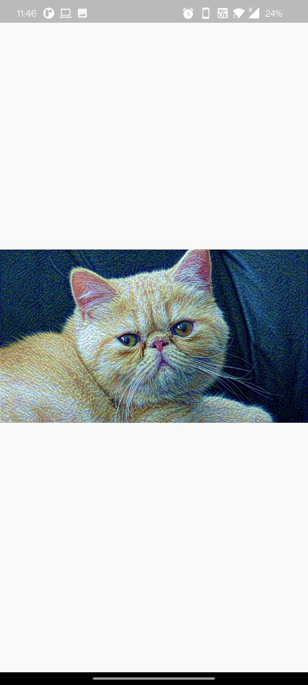

# Style Transfer

This repository contains an implementation of neural style transfer using deep learning techniques, a Flutter frontend and Flask App Backend. Neural style transfer is a technique that allows you to apply the style of one image (the style image) to the content of another image (the content image), resulting in a new image that combines the content of the content image with the style of the style image.

## Table of Contents

- [Style Transfer](#style-transfer)
  - [Table of Contents](#table-of-contents)
  - [Introduction](#introduction)
  - [Installation](#installation)
  - [Usage](#usage)
  - [Examples](#examples)
  - [Contributing](#contributing)
  - [License](#license)

## Introduction

Neural style transfer has gained popularity in recent years for its ability to create visually appealing and artistic images. This repository provides a Python implementation of neural style transfer using the powerful deep learning library, PyTorch. The implementation is based on the paper ["A Neural Algorithm of Artistic Style" by Gatys et al.](https://arxiv.org/abs/1508.06576).

The algorithm works by using a pre-trained convolutional neural network to extract features from both the content image and the style image. These features are then used to calculate the content loss, which measures how different the content image is from the stylized image, and the style loss, which measures how different the style image is from the stylized image. By minimizing these losses, we can generate a new image that combines the content of the content image with the style of the style image.

## Installation

To use this style transfer implementation, please follow the steps below:

1. Clone this repository to your local machine using the following command:

   ```
   git clone https://github.com/ayushvrma/StyleTransfer.git
   ```

2. Install the required dependencies by running the following command:

   ```
   flutter pub get
   ```
   This will install the necessary packages, including PyTorch and Flutter.

## Usage

By running `main.py` you'd be creating a flask backend server for the Frontend of a Flutter App. Simply upload 2 images and get a combined StyleTransfer one.
## Examples

<div style="display: flex;">
    <div style="flex: 50%; padding: 5px;">
        
    </div>
    <div style="flex: 50%; padding: 5px;">
        
    </div>
</div>

## Contributing

Contributions to this repository are welcome. If you find any issues or have suggestions for improvements, please open an issue or submit a pull request.

## License

This repository is licensed under the MIT License. For more information, please refer to the [LICENSE](LICENSE) file.
